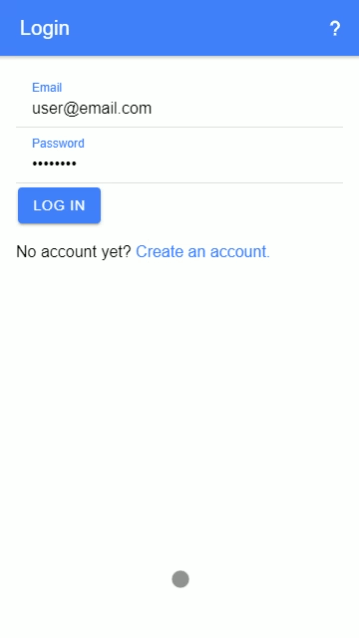
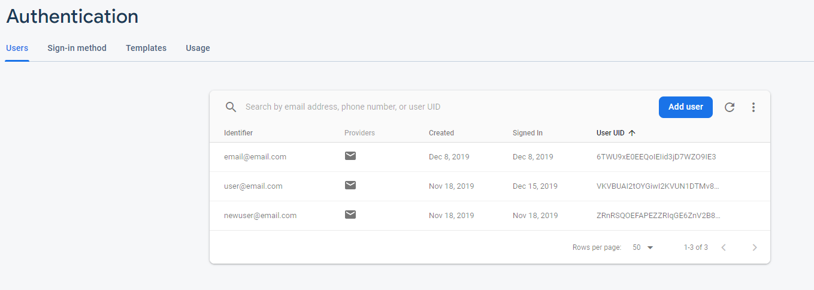
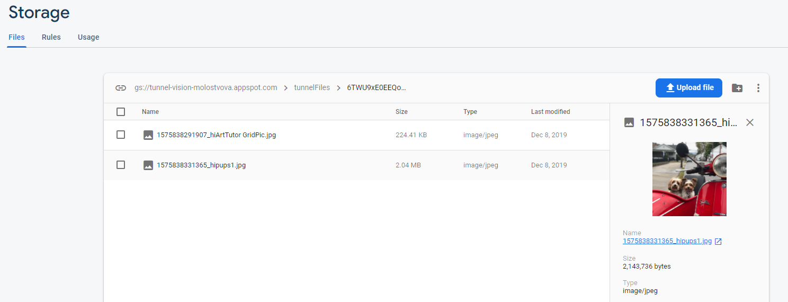
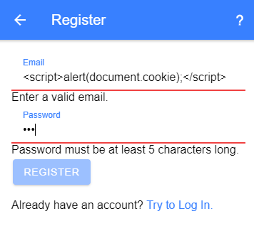
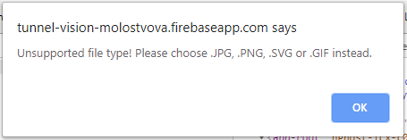

# Tunnel Vision - Software Development & Information Management Capstone
###### Pennsylvania College of Technology
## CIT498 - Final Project Report
##### Ekaterina Molostvova - 12/11/19

## PROJECT SCOPE
### PROJECT ELEVATOR SPEECH
&nbsp;&nbsp;&nbsp;&nbsp;&nbsp;&nbsp;Tunnel Vision is a portable web application that accurately does the recurrent work of starting a photorealistic drawing project. The application allows a user to create an account and upload images that will be there the next time the user logs in. The application then presents the chosen image with a grid over it with the ability to quickly zoom into and isolate a specific square to make replication of the image in real life convenient. 

### TARGET USER
&nbsp;&nbsp;&nbsp;&nbsp;&nbsp;&nbsp;This application and drawing method are well suited for individuals that lack the artistic skills to draw free-hand because this drawing method only requires copying shapes that the person sees without needing to know about anatomy or shading. It is also well suited for artists that are already familiar with drawing and the grid drawing method since this is a simple tool and not a learning utility.

### PROBLEM IDENTIFICATION
&nbsp;&nbsp;&nbsp;&nbsp;&nbsp;&nbsp;When working on a photorealistic drawing, the artist has to physically draw a grid on the starting image and then keep track of the squares every time, reducing the time that could be spent drawing and introducing mistakes. The individual also has to keep the original image on them to keep drawing. There are currently no automatic tools that do this while remaining portable and easy to use.

## NEEDS ANALYSIS & OBJECTIVES/CONSTRAINT IDENTIFICATION
### NEEDS ANALYSIS
&nbsp;&nbsp;&nbsp;&nbsp;&nbsp;&nbsp;The needs are: portability, intuitive and responsive UI, secure distribution system, accessibility, unified backend system.

### OBJECTIVES & CONSTRAINTS
&nbsp;&nbsp;&nbsp;&nbsp;&nbsp;&nbsp;The objectives are: secure user authentication, hosting over HTTPS server, storing data on cloud databases, input validation and sanitization, Database as a Service for backend, the Ionic framework for responsive UI.

## SYSTEM REQUIREMENTS
### For Use: 
&nbsp;&nbsp;&nbsp;&nbsp;&nbsp;&nbsp;The user can access the app from either Android 4.4+, iOS 10+ or a recently updated browser. This allows for a wide range of possible device uses, allowing more people to have access to the app from almost any device they have.

### For Development: 
&nbsp;&nbsp;&nbsp;&nbsp;&nbsp;&nbsp;A developer needs a machine with a current OS that has access to a command-line terminal. The developer also needs to download Node.JS and the Ionic framework. A hosting service will be needed for the app to be live and a preferred code editor is needed for programming. Everything (except possibly developer-choice) is open source and free to use and distribute. For demonstration, a personal Android device and a school-provided browser were used.

## CAPSTONE REQUIREMENTS
### PROGRAMMING COMPONENT
&nbsp;&nbsp;&nbsp;&nbsp;&nbsp;&nbsp;The PWA was set up as an Ionic framework project, with its backend based on the Angular JavaScript library. The pages were written in HTML; CSS and Ionic components used to improve usability, look and responsiveness of the website. The logic for the behavior of the website and the grid system was written in TypeScript, which is a version of JavaScript. The website is responsive, looking and acting like a native app on a mobile device.

### DATABASE COMPONENT
&nbsp;&nbsp;&nbsp;&nbsp;&nbsp;&nbsp;Firebase offers two main options for database storage. One is the Realtime Database, which uses key-value pairs. The other is the Store, which stores documents. The Store database was a better option for this project since the application needs to store images that are uploaded by the user. The user authentication data is stored in a special database, called Authentication. The set-up for these databases involves starting a Firebase project, connecting the application, enabling the databases needed and setting up rules for the database. During development, the rules allowed anyone to read and write to the database, which was changed to be more restrictive for the production stage.

### WEB COMPONENT
&nbsp;&nbsp;&nbsp;&nbsp;&nbsp;&nbsp;A Progressive Web Application is a website hosted over HTTPS that is made to look like an application through the use of the Ionic framework. It is both hosted on Firebase and will connect to the Firebase backend. The Ionic framework was chosen over a native app because in this case portability and user experience are more important than performance. Also, the app does not need to use a lot of the device’s hardware, so a native application is not needed.

### INFORMATION ASSURANCE AND SECURITY COMPONENT
&nbsp;&nbsp;&nbsp;&nbsp;&nbsp;&nbsp;The users are authenticated through a Firebase Authentication service. All their information is hashed and stored on Firebase servers, which encrypt the data. The emails are validated to only include the email-specific symbols, preventing injections. The passwords are validated to include at least 5 characters. When logging in, the application first checks that the user exists in the database, does not allow multiple accounts under the same email, and checks that the password matched to the email. Before uploading the image to the database, the program will first make sure that it’s an image that is being uploaded, displaying an error message if the file is not an image, preventing malicious code to be uploaded to the database. Also, the website is hosted on an HTTPS server, which is more secure than HTTP. The dashboard and image pages are only accessible to logged-in users and URL traversing is not possible since the user information is pulled from the database dynamically, instead of having a user-specific URL. These practices meet the OWASP guidelines of secure websites.

## RESEARCH
### RESEARCH COMPONENT
&nbsp;&nbsp;&nbsp;&nbsp;&nbsp;&nbsp;Firebase is a research component for this project. Firebase is a Backend-as-a-Service developer platform, meant to help with the quick development of mobile and web applications. For this project, a few Firebase services are used. Authentication allows for writing and reading user data, in this app’s case it is only emails and hashed passwords. Firebase also allows login through third-party providers, like Google, GitHub, etc and password-less registration. Firebase Store is used to accept, store and display images that users uploaded through the application. Firebase hosting allows for the application to be hosted on the Firebase servers, even allowing for custom domain use.

&nbsp;&nbsp;&nbsp;&nbsp;&nbsp;&nbsp;Since the needs of this project included portability, a secure distribution system, and a unified backend system, Firebase service was essential to meeting these needs. If a regular SQL database hosted over a server was used, a lot of the project effort would have been spent on securing the said database, taking away from the functionality and User Interface of the app. Since Firebase secures the image and user databases itself, developer mistakes were avoided. When developing a most secure application, a team with a wide array of skills would be needed. Since this was not available, relying on third-party security was the safest option. 

### RESEARCH SOURCES
*Angular/angularfire.* (2016, June 20). Retrieved December 6, 2019, from https://github.com/angular/angularfire.

*Documentation  |  Firebase.* (n.d.). Retrieved December 6, 2019, from https://firebase.google.com/docs.

Mejia, V. (2019). *Angular: Cloud-Powered Apps with Firebase.* Retrieved December 6, 2019, from https://www.linkedin.com/learning/angular-cloud-powered-apps-with-firebase?u=67552594.

## REFLECTIONS
&nbsp;&nbsp;&nbsp;&nbsp;&nbsp;&nbsp;After completing this project as a Progressive Web Application, I have a strong desire to remake it as an Android application instead. At the beginning of the semester I chose to do a PWA because I had a bad experience with figuring out Android Studio and Android APAs, so I thought that a PWA would be a lot less complicated to do. However, I overestimated my familiarity with JavaScript and how different Angular is from what I have done before. It is hard to say what I enjoyed the least as whatever I didn’t enjoy was because I did not have extensive knowledge of it, not because I didn’t like the concept itself. Although, I did not enjoy learning about Angular because I struggled to find good resources, a lot of tutorials were outdated due to frequent updates.

&nbsp;&nbsp;&nbsp;&nbsp;&nbsp;&nbsp;Even though Firebase was my research component, that was the easiest thing to do due to the ample documentation.

&nbsp;&nbsp;&nbsp;&nbsp;&nbsp;&nbsp;My main obstacle was working with TypeScript. It is very similar to JavaScript, but to someone not as familiar with JS as they thought, TS turned out to be very difficult to figure out. Whenever I looked up tutorials, I had trouble finding one's on TypeScript specifically and had to adapt JavaScript ones to what I needed. To handle this, I had to look up a lot of documentation on TypeScript, trying to match it to the equivalent JavaScript. 

&nbsp;&nbsp;&nbsp;&nbsp;&nbsp;&nbsp;I did enjoy learning more about developing web-based applications and their abilities and limitations. I want to continue learning about them to get a better understanding, but working with HTML and JS has made me want to work with Java some more first. I want to explore developing native applications more before coming back to PWAs.

&nbsp;&nbsp;&nbsp;&nbsp;&nbsp;&nbsp;In September, I identified my passion as helping other people. This project did not increase my interest in that passion because I already felt strongly about it, to begin with. However, my interest in making an application and different tools was increased and I would like to continue making something of value to others. To other students, I would recommend thinking about what they already know and what they are good at before starting this project, instead of what their passion is because getting too ambitious with plans for a software will come back to hurt them when they realize they don’t know how to do a certain thing in the middle of the semester. 
